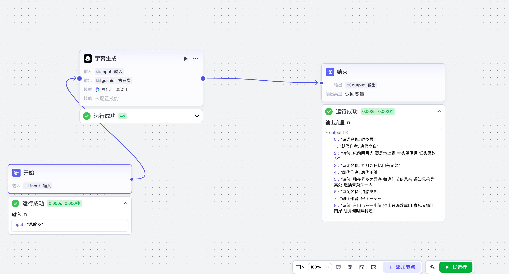
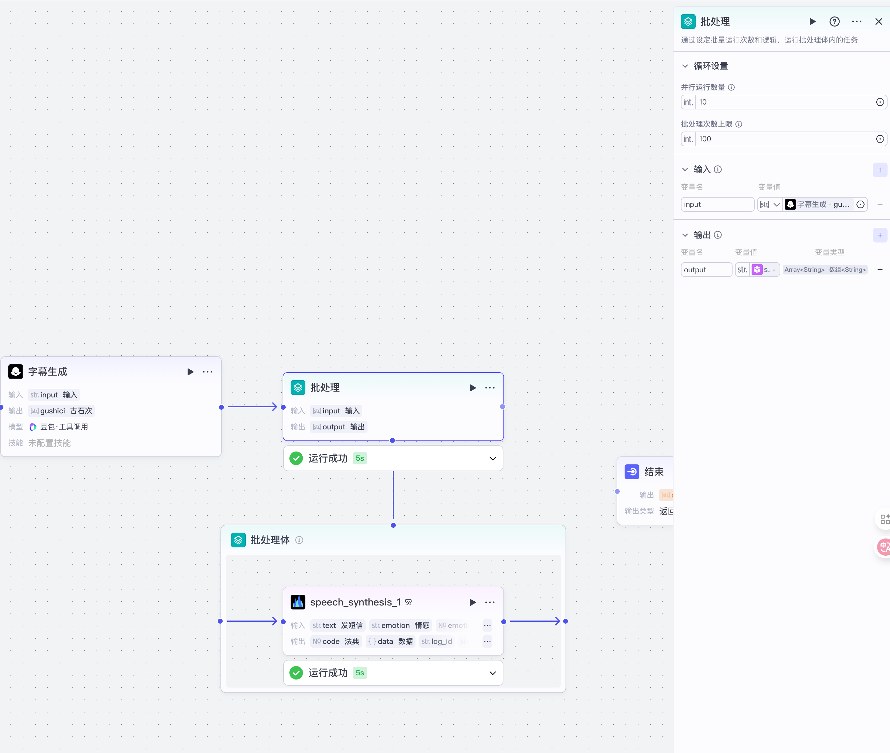

# 无解的游戏 - 文档和学习笔记

<div align="center">
  
</div>

<h3 align="center">一个基于 VitePress 构建的个人知识库和学习笔记网站</h3>

<p align="center">
  <a href="https://github.com/sword-demon/vitepressDocs/stargazers">
    
  </a>
  <a href="https://github.com/sword-demon/vitepressDocs/issues">
    
  </a>
  <a href="https://github.com/sword-demon/vitepressDocs/blob/main/LICENSE">
    
  </a>
</p>

## 📚 项目介绍

这是一个使用 [VitePress](https://vitepress.dev/) 构建的个人文档网站，用于记录和分享技术学习笔记、开发经验和生活感悟。网站内容涵盖了前端、后端、AI 等多个技术领域，是一个持续更新的知识库。

### 🌟 主要特性

- **响应式设计** - 适配各种设备屏幕，提供良好的阅读体验
- **深色模式** - 支持深色和浅色主题切换
- **全文搜索** - 内置本地搜索功能，快速定位内容
- **代码高亮** - 支持多种编程语言的语法高亮
- **Mermaid 图表** - 支持使用 Mermaid 绘制流程图、时序图等
- **时间线** - 支持 Markdown 时间线语法
- **目录导航** - 清晰的侧边栏和页面目录结构

## 🛠 技术栈

- [VitePress](https://vitepress.dev/) - 基于 Vite 的静态站点生成器
- [Vue 3](https://v3.vuejs.org/) - 渐进式 JavaScript 框架
- [TypeScript](https://www.typescriptlang.org/) - JavaScript 的超集
- [Mermaid](https://mermaid-js.github.io/) - 图表和可视化工具
- [Medium Zoom](https://github.com/francoischalifour/medium-zoom) - 图片缩放插件

## 🚀 快速开始

### 本地开发

```bash
# 克隆项目
git clone git@github.com:sword-demon/vitepressDocs.git

# 进入项目目录
cd vitepressDocs

# 安装依赖
pnpm install

# 启动开发服务器
pnpm docs:dev
```

### 构建部署

```bash
# 构建静态文件
pnpm docs:build

# 预览构建结果
pnpm docs:preview
```

## 📖 内容结构

- **指南** - VitePress 使用指南和示例
- **生活&日常** - 生活感悟和日常记录
- **前端学习** - React、Vue 等前端技术学习笔记
- **后端学习** - Java、Go、Python 等后端技术学习笔记
- **AI** - 人工智能相关学习笔记和实践

## 📸 截图演示


*网站首页*


*深色模式界面*


*内置搜索功能*

## 🤝 贡献

欢迎提交 Issue 或 Pull Request 来帮助改进这个项目。

## 📄 许可证

本项目采用 MIT 许可证，详情请查看 [LICENSE](./LICENSE) 文件。

## 📞 联系方式

- GitHub: [@sword-demon](https://github.com/sword-demon)
- Discord: [ViteLand](https://chat.vitejs.dev/)