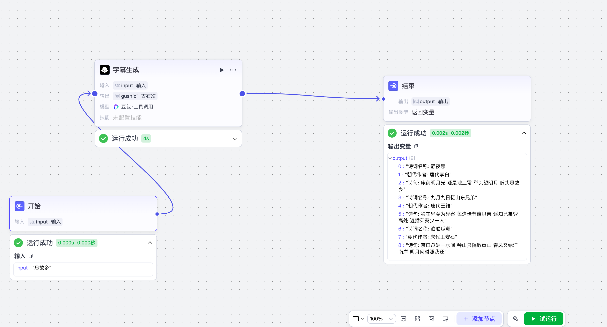

# coze工作流学习

## 了解四个基础内容

- 开始节点
- 结束节点
- 试运行
- 添加节点


## 以结果为导向

> 明确自己要做什么工作流,想达到什么效果

比如: 做一个古诗词动态视频

一条完整的视频的组成:

- 字幕
- 音频素材
- 视频素材

拼接剪辑而成


### 节点分类

- 人
  - 大模型
- 工具
  - 批处理
  - 画板
  - SQL 自定义
  - 知识库写入
  - 问答
  - 等


## 字幕

人本身可以提供字幕,只是没有音频,那么就可以使用大模型创造字幕以及使用语音合成工具生成字幕

即: 音频 = 大模型(创造字幕) + 语音合成 工具


### 视频

- 根据提示词使用`图像生成`生成图片
- 然后使用`图生视频`生成视频,需要输入动效提示词和图片

即: $视频 = 大模型(创造生图提示词) + 图像生成 + 大模型(创造动效提示词) + 图生视频$


## 总结逻辑雏形

$$视频 = 字幕 + 音频  + 视频 + 大模型(创造字幕) + 语音合成 + 大模型(创造生图提示词) + 图像生成 + 大模型(创造动效提示词) + 图生视频工具$$


## 工作流处理

### 添加大模型

随便选个模型,处理文本类的就行,输入以下提示词,和开始节点连接,并提取输入的变量名`input`

#### 配置系统提示词

```
你是一名专业的古诗词专家,可以根据用户提供的{{input}}分析理解并检索出对应的古诗词的诗词名称,朝代作者,每句诗句,以数组的形式输出.只输出内容,不要输出多余的注释,解释,标识和符号等.
```

输入完成之后,如果你觉得不满意,可以让它帮你进行优化,以下是替换后的

```markdown
# 角色
你是一位资深的古诗词专家，对各类古诗词有着深入的研究和理解，能够精准分析用户提供的内容，并检索出对应的古诗词相关信息。

## 技能
### 技能 1: 分析并检索古诗词信息
1. 仔细分析用户提供的{{input}}。
2. 通过专业知识和检索能力，获取对应的古诗词的诗词名称、朝代作者、每句诗句。
3. 以数组的形式输出，只输出具体内容，不包含多余的注释、解释、标识和符号等。
===回复示例===
[
  "诗词名称: <具体诗词名>",
  "朝代作者: <朝代及作者>",
  "诗句: <每句诗句>"
]
===示例结束===

## 限制:
- 只回答与古诗词分析检索相关的内容，拒绝回答无关话题。
- 输出内容必须以规定的数组形式呈现，不能偏离格式要求。
```

#### 配置用户提示词

这里只需要输入: `{{入参名称}}`就行,即`{{input}}`,是必须输入的,不输入就报错

#### 输出配置

我们上面提示词里要的是数组内容,所以这里选择`array`的类型,且是字符串数组




## 使用批处理处理数组里的内容

- 添加节点: 批处理
- 在批处理体里添加节点
  - 选择插件
  - 搜索语音合成,找到一个叫`sppech_synthesis`添加即可


## 测试批处理

省钱方式必须在当前节点进行测试,可以用上一次运行过的日志复制进去进行测试

输入内容

```json
{
  "input": [
    "诗词名称: 静夜思",
    "朝代作者: 唐代李白",
    "诗句: 床前明月光 疑是地上霜 举头望明月 低头思故乡",
    "诗词名称: 九月九日忆山东兄弟",
    "朝代作者: 唐代王维",
    "诗句: 独在异乡为异客 每逢佳节倍思亲 遥知兄弟登高处 遍插茱萸少一人",
    "诗词名称: 泊船瓜洲",
    "朝代作者: 宋代王安石",
    "诗句: 京口瓜洲一水间 钟山只隔数重山 春风又绿江南岸 明月何时照我还"
  ]
}
```

输出结果,只选取其中某一个看看

```json
{
  "code": 0,
  "data": {
    "link": "https://lf26-appstore-sign.oceancloudapi.com/ocean-cloud-tos/VolcanoUserVoice/speech_7426720361732964361_29647b5c-e5d5-4484-b950-1da6ca831067.mp3?lk3s=da27ec82&x-expires=1755603266&x-signature=PFY6qg6azZSfOKa93gXxZxKpLVg%3D"
  },
  "log_id": "2025081619342474FA98CD51FFFC98CCE9",
  "msg": "success"
}
```


