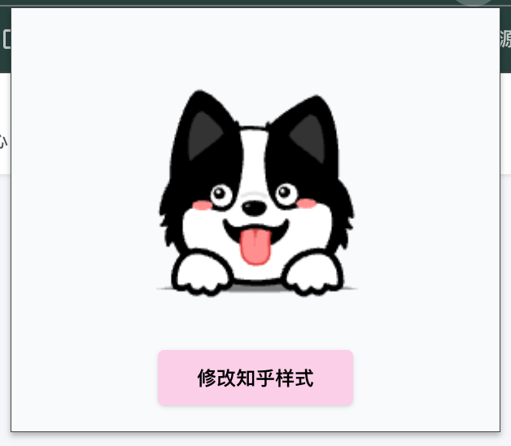

# 使用 cursor 开发一个修改知乎样式的浏览器插件

## 成果



## 下载一个插件脚手架

[GitHub - Jonghakseo/chrome-extension-boilerplate-react-vite: Chrome Extension Boilerplate with React + Vite + Typescript](https://github.com/Jonghakseo/chrome-extension-boilerplate-react-vite)

## 尝试修改内容

按照脚手架`README.md`尝试运行之后，使用`chrome`进行加载未打包的扩展程序，然后看看对应的扩展程序是否生效。

生效之后，我们尝试添加一个按钮：`修改知乎样式`，要求如下

```Plain Text
@Popup.tsx 我希望在弹框中增加一个按钮，叫做修改知乎样式，点击后，能够将页面背景色变成粉色。
```

注意，如果他给你额外生成了一些东西，比如会嵌入网页里加了一个按钮，然后你再跟他对话，取消额外的内容即可。

## 修改图标

按下 F12 获取到知乎的图标，复制`selector`内容

```CSS
#root > div > div.css-121i2wa > header > div > a > svg
```

我们想改成对应的飞书文档的图标，然后我们打开飞书文档的界面，F12 去获取飞书的`logo`

```CSS
<svg width="1em" height="1em" viewBox="0 0 24 24" fill="none" xmlns="http://www.w3.org/2000/svg" data-icon="LarkLogoColorful"><path d="m12.924 12.803.056-.054c.038-.034.076-.072.11-.11l.077-.076.23-.227 1.334-1.319.335-.331c.063-.063.13-.123.195-.183a7.777 7.777 0 0 1 1.823-1.24 7.607 7.607 0 0 1 1.014-.4 13.177 13.177 0 0 0-2.5-5.013 1.203 1.203 0 0 0-.94-.448h-9.65c-.173 0-.246.224-.107.325a28.23 28.23 0 0 1 8 9.098c.007-.006.016-.013.023-.022Z" fill="#00D6B9"></path><path d="M9.097 21.299a13.258 13.258 0 0 0 11.82-7.247 5.576 5.576 0 0 1-.731 1.076 5.315 5.315 0 0 1-.745.7 5.117 5.117 0 0 1-.615.404 4.626 4.626 0 0 1-.726.331 5.312 5.312 0 0 1-1.883.312 5.892 5.892 0 0 1-.524-.031 6.509 6.509 0 0 1-.729-.126c-.06-.016-.12-.029-.18-.044-.166-.044-.33-.092-.494-.14-.082-.024-.164-.046-.246-.072-.123-.038-.247-.072-.366-.11l-.3-.095-.284-.094-.192-.067c-.08-.025-.155-.053-.234-.082a3.49 3.49 0 0 1-.167-.06c-.11-.04-.221-.079-.328-.12-.063-.025-.126-.047-.19-.072l-.252-.098c-.088-.035-.18-.07-.268-.107l-.174-.07c-.072-.028-.141-.06-.214-.088l-.164-.07c-.057-.024-.114-.05-.17-.075l-.149-.066-.135-.06-.14-.063a90.183 90.183 0 0 1-.141-.066 4.808 4.808 0 0 0-.18-.083c-.063-.028-.123-.06-.186-.088a5.697 5.697 0 0 1-.199-.098 27.762 27.762 0 0 1-8.067-5.969.18.18 0 0 0-.312.123l.006 9.21c0 .4.199.779.533 1a13.177 13.177 0 0 0 7.326 2.205Z" fill="#3370FF"></path><path d="M23.732 9.295a7.55 7.55 0 0 0-3.35-.776 7.521 7.521 0 0 0-2.284.35c-.054.016-.107.035-.158.05a8.297 8.297 0 0 0-.855.35 7.14 7.14 0 0 0-.552.297 6.716 6.716 0 0 0-.533.347c-.123.089-.243.18-.363.275-.13.104-.252.211-.375.321-.067.06-.13.123-.196.184l-.334.328-1.338 1.321-.23.228-.076.075c-.038.038-.076.073-.11.11l-.057.054a1.914 1.914 0 0 1-.085.08c-.032.028-.063.06-.095.088a13.286 13.286 0 0 1-2.748 1.946c.06.028.12.057.18.082l.142.066c.044.022.091.041.139.063l.135.06.149.067.17.075.164.07c.073.031.142.06.215.088.056.025.116.047.173.07.088.034.177.072.268.107.085.031.168.066.253.098l.189.072c.11.041.218.082.328.12.057.019.11.041.167.06.08.028.155.053.234.082l.192.066.284.095.3.095c.123.037.243.075.366.11l.246.072c.164.048.331.095.495.14.06.015.12.03.18.043.114.029.227.05.34.07.13.022.26.04.389.057a5.815 5.815 0 0 0 .994.019 5.172 5.172 0 0 0 1.413-.3 5.405 5.405 0 0 0 .726-.334c.06-.035.122-.07.182-.108a7.96 7.96 0 0 0 .432-.297 5.362 5.362 0 0 0 .577-.517 5.285 5.285 0 0 0 .37-.429 5.797 5.797 0 0 0 .527-.827l.13-.258 1.166-2.325-.003.006a7.391 7.391 0 0 1 1.527-2.186Z" fill="#133C9A"></path></svg>
```

然后我们需要告诉 AI 怎么去修改

```Plain Text
@Popup.tsx 现在我们来完成修改知乎logo的操作：

1. 用户点击修改知乎样式后，将 #root > div > div:nth-child(2) > header > div.AppHeader-inner.css-11p8nt5 > a > svg这个logo，修改成为<svg width="1em" height="1em" viewBox="0 0 24 24" fill="none" xmlns="http://www.w3.org/2000/svg" data-icon="LarkLogoColorful"><path d="m12.924 12.803.056-.054c.038-.034.076-.072.11-.11l.077-.076.23-.227 1.334-1.319.335-.331c.063-.063.13-.123.195-.183a7.777 7.777 0 0 1 1.823-1.24 7.607 7.607 0 0 1 1.014-.4 13.177 13.177 0 0 0-2.5-5.013 1.203 1.203 0 0 0-.94-.448h-9.65c-.173 0-.246.224-.107.325a28.23 28.23 0 0 1 8 9.098c.007-.006.016-.013.023-.022Z" fill="#00D6B9"></path><path d="M9.097 21.299a13.258 13.258 0 0 0 11.82-7.247 5.576 5.576 0 0 1-.731 1.076 5.315 5.315 0 0 1-.745.7 5.117 5.117 0 0 1-.615.404 4.626 4.626 0 0 1-.726.331 5.312 5.312 0 0 1-1.883.312 5.892 5.892 0 0 1-.524-.031 6.509 6.509 0 0 1-.729-.126c-.06-.016-.12-.029-.18-.044-.166-.044-.33-.092-.494-.14-.082-.024-.164-.046-.246-.072-.123-.038-.247-.072-.366-.11l-.3-.095-.284-.094-.192-.067c-.08-.025-.155-.053-.234-.082a3.49 3.49 0 0 1-.167-.06c-.11-.04-.221-.079-.328-.12-.063-.025-.126-.047-.19-.072l-.252-.098c-.088-.035-.18-.07-.268-.107l-.174-.07c-.072-.028-.141-.06-.214-.088l-.164-.07c-.057-.024-.114-.05-.17-.075l-.149-.066-.135-.06-.14-.063a90.183 90.183 0 0 1-.141-.066 4.808 4.808 0 0 0-.18-.083c-.063-.028-.123-.06-.186-.088a5.697 5.697 0 0 1-.199-.098 27.762 27.762 0 0 1-8.067-5.969.18.18 0 0 0-.312.123l.006 9.21c0 .4.199.779.533 1a13.177 13.177 0 0 0 7.326 2.205Z" fill="#3370FF"></path><path d="M23.732 9.295a7.55 7.55 0 0 0-3.35-.776 7.521 7.521 0 0 0-2.284.35c-.054.016-.107.035-.158.05a8.297 8.297 0 0 0-.855.35 7.14 7.14 0 0 0-.552.297 6.716 6.716 0 0 0-.533.347c-.123.089-.243.18-.363.275-.13.104-.252.211-.375.321-.067.06-.13.123-.196.184l-.334.328-1.338 1.321-.23.228-.076.075c-.038.038-.076.073-.11.11l-.057.054a1.914 1.914 0 0 1-.085.08c-.032.028-.063.06-.095.088a13.286 13.286 0 0 1-2.748 1.946c.06.028.12.057.18.082l.142.066c.044.022.091.041.139.063l.135.06.149.067.17.075.164.07c.073.031.142.06.215.088.056.025.116.047.173.07.088.034.177.072.268.107.085.031.168.066.253.098l.189.072c.11.041.218.082.328.12.057.019.11.041.167.06.08.028.155.053.234.082l.192.066.284.095.3.095c.123.037.243.075.366.11l.246.072c.164.048.331.095.495.14.06.015.12.03.18.043.114.029.227.05.34.07.13.022.26.04.389.057a5.815 5.815 0 0 0 .994.019 5.172 5.172 0 0 0 1.413-.3 5.405 5.405 0 0 0 .726-.334c.06-.035.122-.07.182-.108a7.96 7.96 0 0 0 .432-.297 5.362 5.362 0 0 0 .577-.517 5.285 5.285 0 0 0 .37-.429 5.797 5.797 0 0 0 .527-.827l.13-.258 1.166-2.325-.003.006a7.391 7.391 0 0 1 1.527-2.186Z" fill="#133C9A"></path></svg>这个logo。

2. 在logo旁边添加一个文字：飞书云文档

3. 移除刚才修改为粉色背景的操作，刚才只是作为测试使用
```

## 修改标题

在知乎里 F12 找到一个标题的类元素为`QuestionHeader-title`

然后在`cursor`里输入

```Plain Text
请你将页面当中所有具有QuestionHeader-title 这个类名的元素里面的文本都修改成为 xxx项目文档。
```

## 修改主题色

找到知乎的主题色的变量为：`--GBL01A: var(--MapInfo);`

然后让 cursor 进行修改

```Plain Text
我希望将这个 --GBL01A: var(--MapInfo); 变量的颜色修改为黑色
```

## 隐藏页面的多余内容

需要仔细分析页面元素内容，找到侧边部分的类元素：`Question-sideColumn`

头部有个内容，需要你先下拉一下页面，才会展示出来，找到对应的元素为：`QuestionHeader-side`

然后使用 cursor 让 AI 完成移除这 2 个部分的内容

```Plain Text
请你帮我同时移除掉 Question-sideColumn 和 QuestionHeader-side 这两个类元素的内容
```

## 拓宽主题内容宽度

找到内容区域的元素：`Question-mainColumn`

我一开始找错了，所以有了下面这个提示词

```Plain Text
请你将 Question-mainColumn 这个类元素的宽度设置为 100%，并将我刚才的 Question-main 设置的移除
```

## 取出内容块里面的视频和图片

找到内容块的类元素：`AnswerItem`

```Plain Text
请你帮我将 .AnswerItem 类元素下的所有视频和图片都隐藏掉
```

经过测试，只能将你眼睛看到的当前页面的内容里的视频和图片隐藏，如果你继续下拉，就会加载新数据，新数据里的视频和图片还是存在的，所以我们还需要进行修改

```Plain Text
非常好，但是现在又一个问题，图片和视频会在新加载的数据里面展示，所以我每次都要点击一下按钮。是否可以隐藏 .AnswerItem 下的视频和图片，通过轮训的方式进行隐藏，每秒执行
```

## 修改插件的标题 logo 和描述

找一个萌宠的图标 [iconfont-阿里巴巴矢量图标库](https://www.iconfont.cn/collections/detail?spm=a313x.home_index.i1.dfa9d9a29.58a33a81uOx4cD&cid=51002)

下载一个 34 和 128 的 png 的图片修改名称放到`chrome-extension/public`目录下替换原来的图标

再次编译打包，我们到浏览器里看到我们的插件的图标就变成了一只萌宠头像了。

### 然后我们来修改插件的名称和插件的描述

@`chrome-extension/manifest.ts`

@`packages/i18n/locales/en/messages.json`

```Plain Text
@manifest.ts 修改插件的名字叫做：小狗爱摸鱼
@messages.json 修改这个插件的描述：用来一键对知乎进行换装，方便摸鱼
```

打包编译之后，记得刷新一下，查看我们的插件信息是否都改变了。

### 修改弹框的样式

接下来我们来解决这个弹框的样式的问题，目前这个弹框样式还是很丑的，而且有很多其他元素，我们都不太需要

```Plain Text
@Popup.tsx 修改弹框的样式，我希望这个按钮的名称修改为：修改知乎样式，并且移除其他所有元素，我目前只希望这个弹框里有这么一个按钮 + 我们的logo。logo使用：chrome-extension/public/icon-128.png
```

### 限制插件只在知乎显示

```Plain Text
@manifest.ts 我希望这个插件目前只在知乎的问答的详情页才进行显示，目前的详情页的链接如下：@https://www.zhihu.com/question/390635068 。最后一个id可能会发生变化，所以说我希望你修改一下相关的权限，其他的网页都不要显示该插件！
```

可以测试一下，你会发现其他网站上确实就不再显示我们的插件了

主要修改的是下面这些代码，后面如果其他网站修改，那么也是在这里修改

```JavaScript
content_scripts: [
    {
      matches: ['https://www.zhihu.com/question/*'],
      js: ['content/all.iife.js'],
    },
    {
      matches: ['https://www.zhihu.com/question/*'],
      js: ['content-ui/all.iife.js'],
    },
    {
      matches: ['https://www.zhihu.com/question/*'],
      css: ['content.css'],
    },
  ],
```

### 移除不必要的功能

之后你可能会发现页面的底部现在有一个插件的样式，那么这部分的样式是这个工具优秀的一点。它提供了`content ui`这个目录，通过 React 去编写网站上的复杂样式的能力，但是我们这个插件没有用到，所以我们可以将其移除掉。

```JavaScript
{
      matches: ['https://www.zhihu.com/question/*'],
      js: ['content-ui/all.iife.js'],
    },
```

如果说你的 chrome 插件是需要在网页上有很多复杂的操作以及显示效果，那么就需要用到 content-ui。这样编写相关的代码/样式/页面交互会方便很多。

```JavaScript
这边我没有使用到 @content-ui ，是否能够通过相关的配置将它移除掉？目前在底部有一个样式，我是不需要的。
```

新增 tab 页面给注释掉，在 manifest.ts 中找到这行页面，注释掉就好。

```JavaScript
  // chrome_url_overrides: {
  //   newtab: 'new-tab/index.html',
  // },
```

## 构建生产包

打开命令

```Shell
pnpm build
```

构建成功之后，依然是一个`dist`目录，这个包我们就可以用来上架`Chrome`应用商店，或者直接转发 给你的朋友进行使用。
