# n8n+crawl4ai

## 安装 crawl4ai

```bash
docker pull unclecode/crawl4ai:all-arm64

# 不同平台的选择不同的拉取镜像的方式
docker pull unclecode/crawl4ai:all-amd64
```

启动一个容器

```bash
docker run --rm -it \
-e CRAWL4AI_API_TOKEN=12345 \
-p 11235:11235 \
unclecode/crawl4ai:all-arm64
```

```bash
docker run --rm -it \
-e CRAWL4AI_API_TOKEN=12345 \
-p 11235:11235 \
unclecode/crawl4ai:all-arm64
INFO:     Started server process [1]
INFO:     Waiting for application startup.
INFO:     Application startup complete.
INFO:     Uvicorn running on http://0.0.0.0:11235 (Press CTRL+C to quit)
INFO:     192.168.215.1:53119 - "GET / HTTP/1.1" 307 Temporary Redirect
INFO:     192.168.215.1:53119 - "GET /mkdocs HTTP/1.1" 307 Temporary Redirect
INFO:     192.168.215.1:53119 - "GET /mkdocs/ HTTP/1.1" 200 OK
```

使用`127.0.0.1:11235`进行访问，如果看到了他的文档页面，则说明成功了。

它的依据是找到网站的`sitemaps.xml`来实现抓取内容的，如果有的网站没有的话，可以去这个网站将对应的网址复制进去就可以生成：`https://www.xml-sitemaps.com/`

抓取数据的时候还需要参考网站的`robots.txt`

案例网址：`https://docs.crawl4ai.com/sitemap.xml`

## n8n 本地部署安装

```bash
docker volume create n8n_data
docker run -it --rm --name n8n -p 5678:5678 -v n8n_data:/home/node/.n8n -v ~/Downloads/md:/home/node -e N8N_COMMUNITY_PACKAGES_ALLOW_TOOL_USAGE=true docker.n8n.io/n8nio/n8n
```

## 搭建工作

1. 选择`on change message`，随便输入一段内容就可以触发节点开始，这里我们输入：`https://docs.crawl4ai.com/sitemap.xml`，方便后续的 HTTP 请求测试

2. 添加一个新节点，输入`HTTP Request`，URL 选择上一步的`chatInput`，拖拽过去就行。

   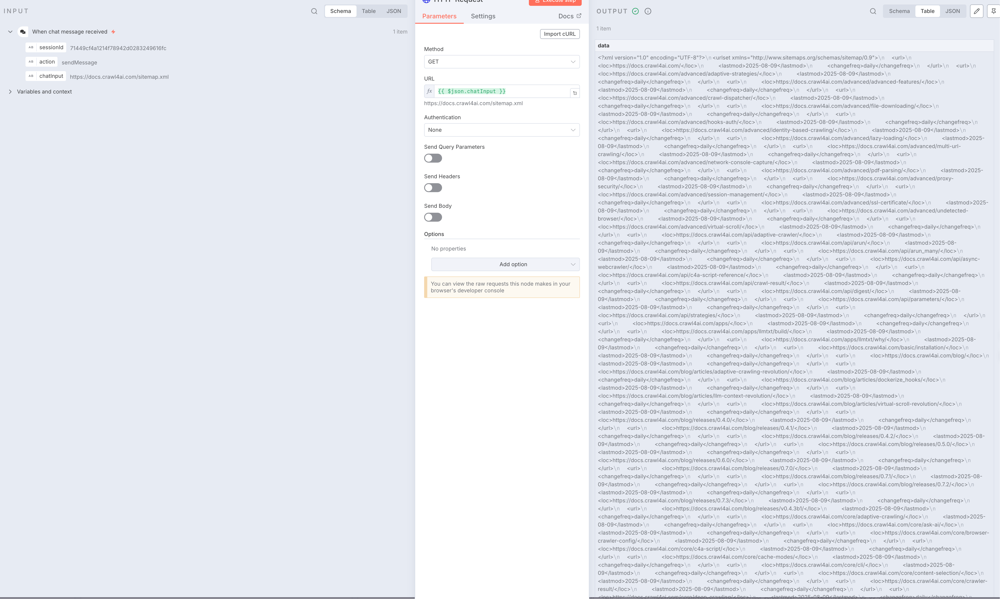

3. 我们拿到的是一个`xml`内容，所以我们需要转换成`json`格式
4. 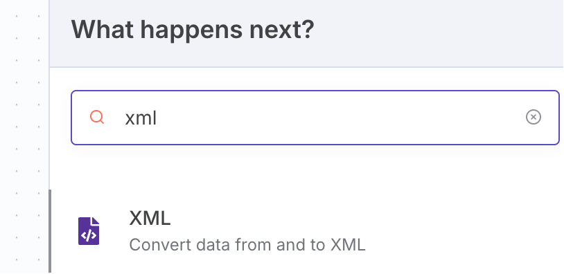

5. 我们搜索一个`xml`节点，里面有可以将`xml`转换成`json`的选项配置
6. 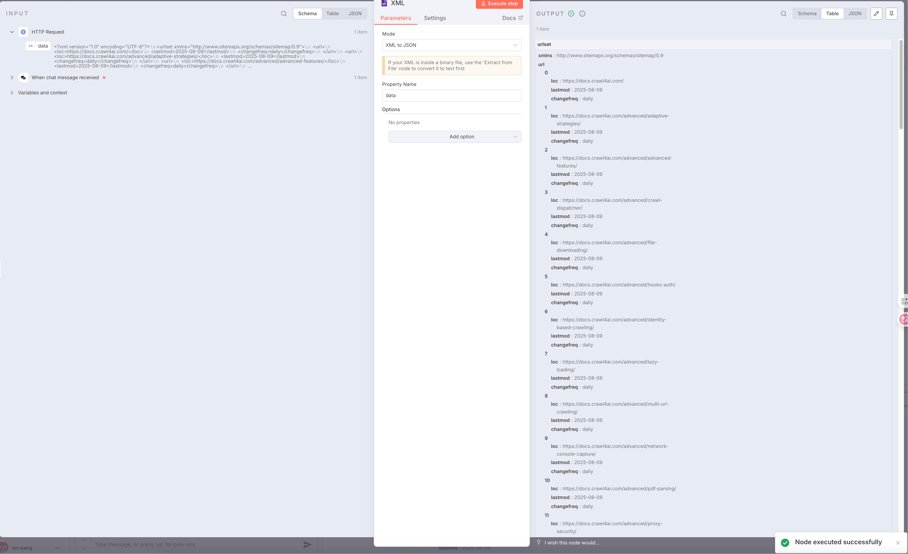

7. 接着选择一个新节点，输入`Split Out`，将左侧的`urlset.url`拖拽过来放入`Fields To Split Out`输入框里，点击测试可以得到一个数据

   ```json
   [
     {
       "loc": "https://docs.crawl4ai.com/",
       "lastmod": "2025-08-09",
       "changefreq": "daily"
     },
     {
       "loc": "https://docs.crawl4ai.com/advanced/adaptive-strategies/",
       "lastmod": "2025-08-09",
       "changefreq": "daily"
     },
     {
       "loc": "https://docs.crawl4ai.com/advanced/advanced-features/",
       "lastmod": "2025-08-09",
       "changefreq": "daily"
     },
     {
       "loc": "https://docs.crawl4ai.com/advanced/crawl-dispatcher/",
       "lastmod": "2025-08-09",
       "changefreq": "daily"
     },
     {
       "loc": "https://docs.crawl4ai.com/advanced/file-downloading/",
       "lastmod": "2025-08-09",
       "changefreq": "daily"
     },
     {
       "loc": "https://docs.crawl4ai.com/advanced/hooks-auth/",
       "lastmod": "2025-08-09",
       "changefreq": "daily"
     },
     {
       "loc": "https://docs.crawl4ai.com/advanced/identity-based-crawling/",
       "lastmod": "2025-08-09",
       "changefreq": "daily"
     },
     {
       "loc": "https://docs.crawl4ai.com/advanced/lazy-loading/",
       "lastmod": "2025-08-09",
       "changefreq": "daily"
     },
     {
       "loc": "https://docs.crawl4ai.com/advanced/multi-url-crawling/",
       "lastmod": "2025-08-09",
       "changefreq": "daily"
     },
     {
       "loc": "https://docs.crawl4ai.com/advanced/network-console-capture/",
       "lastmod": "2025-08-09",
       "changefreq": "daily"
     }
   ]
   ```

8. 添加一个`Limit`节点，来限制抓取的数量，这里我们输入 2 个就行
9. 再添加一个`Loop Over Items`，来处理循环，这里我们每次循环只处理一个`url`，`Batch Size`输入 1 即可。
10. 将循环的一个处理节点换成`HTTP Request`，换成`Post`请求，地址换成：`http://host.docker.internal:11235/crawl`，这是我们使用 docker 部署的 crawl4ai 提供的抓取数据的 API，注意我们使用的是 docker 部署的，所以得这么写。还需添加反向代理，
11. 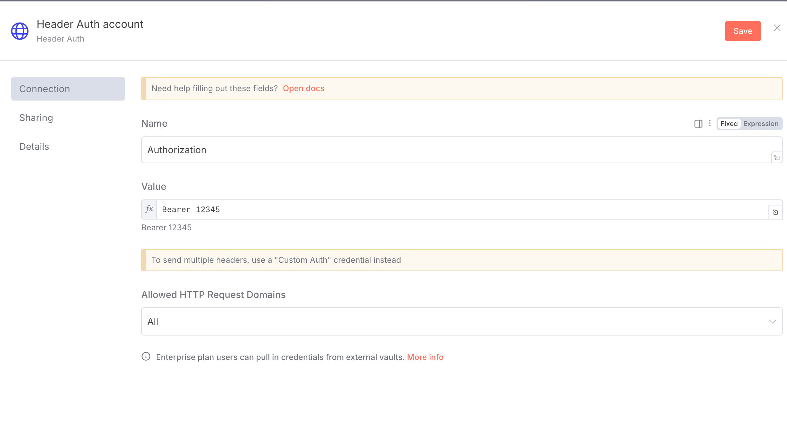

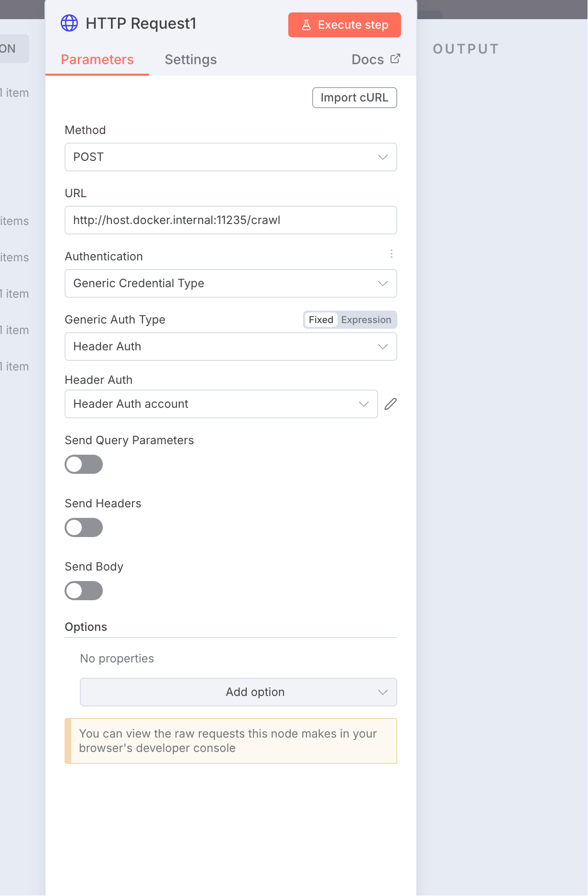

还得打开下面的`Send Body`开关，消息体需要 2 个字段，一个是`urls`一个是`priority`

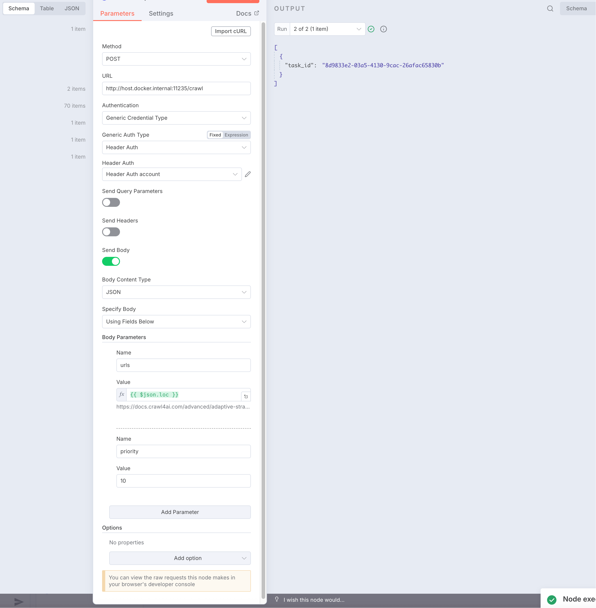

这里的返回结果是一个`task_id`，我们现在配置的只是创建了一个抓取任务，真正去执行抓取任务的还得另外配置。

最后我们再添加一个`wait`节点，输入等待的 7 秒，这是为了让我们每次抓取数据之前等待几秒，防止对方网站触发风控。

最后在添加一个`HTTP Request`节点，最终就是调用`crawl4ai`的抓取接口来执行抓取任务返回结果。

输入链接为：`http://host.docker.internal:11235/task/2个大括号 变量获取的任务id 2个大括号结束`

> 这里因为`mdc`编译问题，导致对应的任务 id 可能不能以英文形式展现。

这里的`task_id`也就是前面步骤获取到的`task_id`,请求验证方式和前面一样。

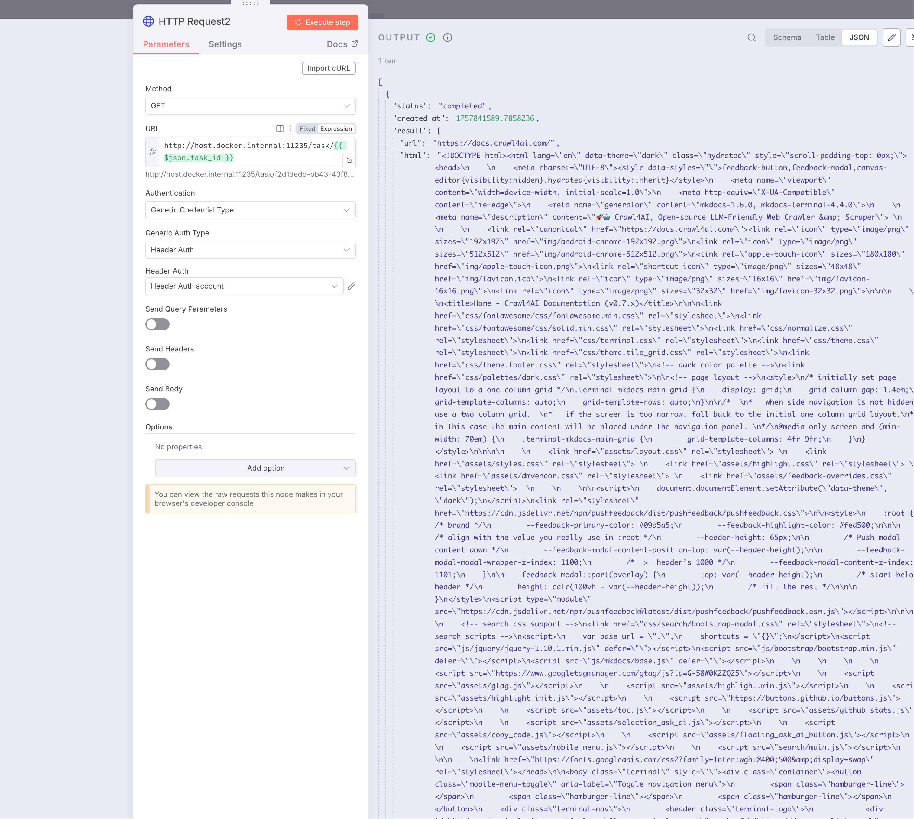

注意这里的`status`的状态值是`completed`，下面我们就可以使用`if`节点来判断是否抓取成功了。

添加`if`节点之后，可以直接拖拽左侧`status`过来，然后`is equal to`，右侧填写`completed`来进行测试。

`if`节点会返回 2 个选项，一个是`true`，一个是`false`，我们再返回`true`的节点后面添加一个`AI Agent`

这里我们选择`Define below`，输入以下提示词：

```markdown
角色设定：
你是一名信息结构化和知识库开发的专家，请始终保持专业态度。你的任务是将 markdown 数据整理为适合 LLM 驱动的 RAG 知识库的结构化、易读格式。

任务要求：

1. 内容解析：
   - 识别 markdown 数据中的关键内容和主要结构
2. 结构化整理
   - 以清晰的标题和分层逻辑组织信息，使其易于检索和理解
   - 保留所有可能对回答用户查询有价值的细节
3. 创建 FAQ (如适用)
   - 根据内容提炼出常见问题，并提供清晰、直接的解答
4. 提升可读性
   - 采用项目符号、编号列表、段落分隔等格式化排版，使内容更直观
5. 优化输出
   - 严格去除 AI 生成的附加说明，仅保留清理后的核心数据

响应规则：

1. 完整性：确保所有相关信息完整保留，避免丢失对搜索和理解有价值的内容
2. 精准性：FAQ 需紧密围绕内容，确保清晰、简洁且符合用户需求
3. 结构优化：确保最终输出便于分块存储、向量化处理，并支持高效检索

数据输入：
<markdown>XXX</markdown>
```

最终找到左侧下边的一个`markdown`拖拽过来替换掉`XXX`

变成

```markdown
<markdown>2 个大括号 美元符 json.result.markdown 2 个大括号结束</markdown>
```

然后给`AI Agent`添加`chat model`，选择`DeepSeek`，输入对应的`API KEY`，选择`deepseek-chat`模型就足够了。

然后我们可以点击测试看看结果。

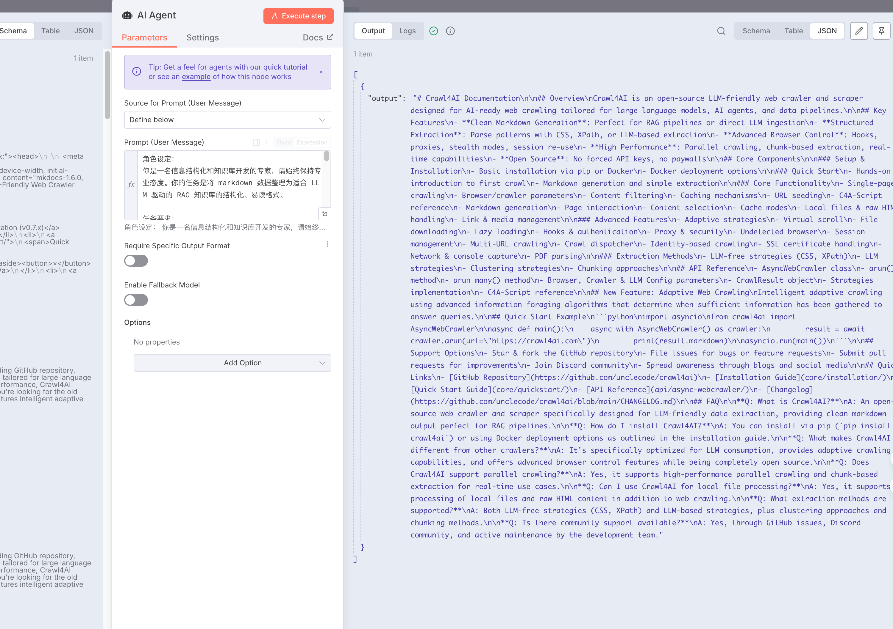

最终我们添加一个`Convert to text file`节点，保存到本地文件内容中

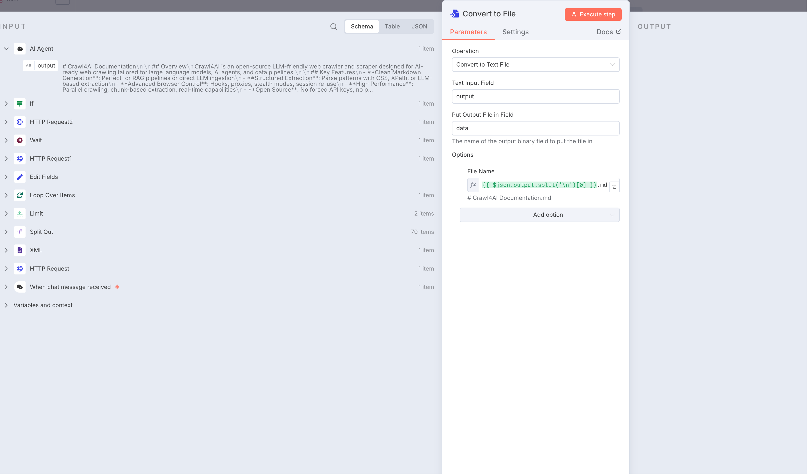

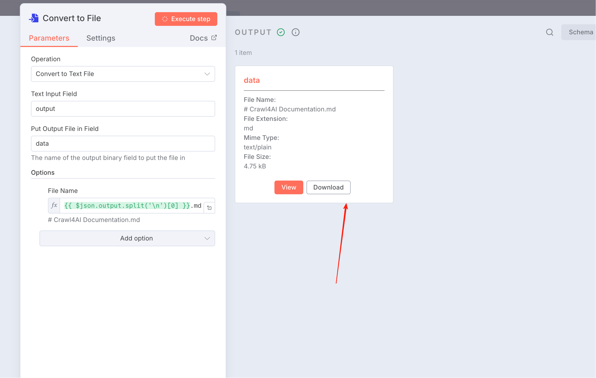

## 最终内容

````markdown
# Crawl4AI Documentation

## Overview

Crawl4AI is an open-source LLM-friendly web crawler and scraper designed for AI-ready web crawling tailored for large language models, AI agents, and data pipelines.

## Key Features

- **Clean Markdown Generation**: Perfect for RAG pipelines or direct LLM ingestion
- **Structured Extraction**: CSS, XPath, or LLM-based pattern parsing
- **Advanced Browser Control**: Hooks, proxies, stealth modes, session re-use
- **High Performance**: Parallel crawling, chunk-based extraction, real-time capabilities
- **Open Source**: No forced API keys or paywalls

## Core Components

### Installation & Setup

- **Installation**: Available via pip or Docker
- **Docker Deployment**: Containerized deployment options

### Crawling Methods

- **Simple Crawling**: Basic single-page crawling
- **Deep Crawling**: Comprehensive multi-page crawling
- **Adaptive Crawling**: Intelligent crawling with information foraging algorithms
- **URL Seeding**: Custom URL starting points

### Technical Features

- **C4A-Script**: Custom scripting capabilities
- **Browser/Crawler/LLM Config**: Fine-grained configuration control
- **Markdown Generation**: Content conversion to markdown format
- **Fit Markdown**: Optimized markdown output
- **Page Interaction**: Dynamic page engagement
- **Content Selection**: Targeted content extraction
- **Cache Modes**: Various caching strategies
- **Local Files & Raw HTML**: Support for local content processing
- **Link & Media Handling**: Comprehensive asset management

### Advanced Features

- **Adaptive Strategies**: Intelligent crawling decisions
- **Virtual Scroll**: Handling infinite scroll pages
- **File Downloading**: Asset download capabilities
- **Lazy Loading**: Efficient content loading
- **Hooks & Authentication**: Custom authentication handling
- **Proxy & Security**: Secure crawling options
- **Undetected Browser**: Stealth browsing capabilities
- **Session Management**: Persistent session handling
- **Multi-URL Crawling**: Concurrent URL processing
- **Crawl Dispatcher**: Distributed crawling management
- **Identity Based Crawling**: User-specific crawling
- **SSL Certificate**: Secure connections handling
- **Network & Console Capture**: Comprehensive monitoring
- **PDF Parsing**: Document processing capabilities

### Extraction Strategies

- **LLM-Free Strategies**: Traditional extraction methods
- **LLM Strategies**: AI-powered extraction approaches
- **Clustering Strategies**: Content grouping techniques
- **Chunking**: Content segmentation methods

## Quick Start Example

```python
import asyncio
from crawl4ai import AsyncWebCrawler

async def main():
    async with AsyncWebCrawler() as crawler:
        result = await crawler.arun(url="https://crawl4ai.com")
        print(result.markdown)

asyncio.run(main())
```

## Support Options

- **GitHub**: Star, fork, or file issues on the repository
- **Discord**: Join community discussions
- **Contributions**: Pull requests welcome for fixes and features
- **Documentation**: Improve documentation through contributions

## Quick Links

- [GitHub Repository](https://github.com/unclecode/crawl4ai)
- [Installation Guide](core/installation/)
- [API Reference](api/async-webcrawler/)
- [Changelog](https://github.com/unclecode/crawl4ai/blob/main/CHANGELOG.md)

## FAQ

**Q: What is Crawl4AI?**
A: An open-source web crawler and scraper specifically designed for LLM-friendly data extraction and processing.

**Q: How do I install Crawl4AI?**
A: You can install via pip (`pip install crawl4ai`) or using Docker deployment options.

**Q: What makes Crawl4AI different from other crawlers?**
A: It's specifically optimized for AI workflows with clean markdown output, LLM-friendly formatting, and adaptive crawling capabilities.

**Q: Does Crawl4AI support authentication?**
A: Yes, through its hooks and authentication features in the advanced section.

**Q: Can I use Crawl4AI for commercial projects?**
A: Yes, it's open source and free to use for both personal and commercial projects.

**Q: What types of content can Crawl4AI extract?**
A: It can handle HTML content, markdown generation, PDF parsing, file downloading, and media/link extraction.

**Q: How does adaptive crawling work?**
A: It uses information foraging algorithms to determine when sufficient information has been gathered to answer specific queries.

**Q: Is there community support available?**
A: Yes, through GitHub issues and Discord community channels.

**Q: Can I contribute to the project?**
A: Yes, the project welcomes contributions through pull requests, issue reporting, and documentation improvements.

**Q: What programming language is required?**
A: Python is the primary language for using and contributing to Crawl4AI.
````

## 上面的操作还只是保留在容器内部，我们需要一个节点写入到磁盘中

添加`Read/Write to disk`，设置文件名：`/home/node/2个大括号 美元符('AI Agent').item.json.output.split('\n')[0] 2个大括号结束.md`

因为我们`n8n`是通过`docker`容器启动的，映射到本地文件路径/`Downloads/md`下，所以要填写容器内部的地址前缀。

## my workflow json

```json
{
  "name": "My workflow",
  "nodes": [
    {
      "parameters": {
        "options": {}
      },
      "type": "@n8n/n8n-nodes-langchain.chatTrigger",
      "typeVersion": 1.3,
      "position": [-944, -128],
      "id": "fb413867-055f-44db-85bc-4565f64f5388",
      "name": "When chat message received",
      "webhookId": "9f595d89-bf70-4306-b0a2-74dcca651e43"
    },
    {
      "parameters": {
        "url": "=2个大括号 美元符json.chatInput 2个大括号结束",
        "options": {}
      },
      "type": "n8n-nodes-base.httpRequest",
      "typeVersion": 4.2,
      "position": [-736, -128],
      "id": "a4e15e4e-85e2-4eb9-b354-631be57a107e",
      "name": "HTTP Request"
    },
    {
      "parameters": {
        "options": {}
      },
      "type": "n8n-nodes-base.xml",
      "typeVersion": 1,
      "position": [-528, -128],
      "id": "0a5ce195-fae3-4f0e-8199-047fa11b82fa",
      "name": "XML"
    },
    {
      "parameters": {
        "fieldToSplitOut": "urlset.url",
        "options": {}
      },
      "type": "n8n-nodes-base.splitOut",
      "typeVersion": 1,
      "position": [-320, -128],
      "id": "ffb5ad33-7d5c-488b-bd31-5ce586b8d3ac",
      "name": "Split Out"
    },
    {
      "parameters": {
        "maxItems": 2
      },
      "type": "n8n-nodes-base.limit",
      "typeVersion": 1,
      "position": [-112, -128],
      "id": "8c6d0ccd-333e-4d6f-a3e5-5231e94e4b9c",
      "name": "Limit"
    },
    {
      "parameters": {
        "options": {}
      },
      "type": "n8n-nodes-base.splitInBatches",
      "typeVersion": 3,
      "position": [96, -128],
      "id": "e9bf6aee-b1e6-491a-ae6c-d0d40733df57",
      "name": "Loop Over Items"
    },
    {
      "parameters": {
        "method": "POST",
        "url": "http://host.docker.internal:11235/crawl",
        "authentication": "genericCredentialType",
        "genericAuthType": "httpHeaderAuth",
        "sendBody": true,
        "bodyParameters": {
          "parameters": [
            {
              "name": "urls",
              "value": "=2个大括号 美元符json.loc 2个大括号结束"
            },
            {
              "name": "priority",
              "value": "10"
            }
          ]
        },
        "options": {}
      },
      "type": "n8n-nodes-base.httpRequest",
      "typeVersion": 4.2,
      "position": [352, -96],
      "id": "af597253-6c8c-4e7b-a23d-a14d9d35a69c",
      "name": "HTTP Request1",
      "credentials": {
        "httpHeaderAuth": {
          "id": "j0XlGDse0pJoeuzb",
          "name": "Header Auth account"
        }
      }
    },
    {
      "parameters": {
        "amount": 7
      },
      "type": "n8n-nodes-base.wait",
      "typeVersion": 1.1,
      "position": [560, -160],
      "id": "1eeb5736-24c1-49e7-8aad-0f8a71b2d014",
      "name": "Wait",
      "webhookId": "3453b908-cc4e-44f3-9091-8431a83ebbad"
    },
    {
      "parameters": {
        "url": "=http://host.docker.internal:11235/task/2个大括号 任务id 2个大括号结束",
        "authentication": "genericCredentialType",
        "genericAuthType": "httpHeaderAuth",
        "options": {}
      },
      "type": "n8n-nodes-base.httpRequest",
      "typeVersion": 4.2,
      "position": [768, -160],
      "id": "e980b1b9-25c5-499a-8995-51c61c51a44c",
      "name": "HTTP Request2",
      "credentials": {
        "httpHeaderAuth": {
          "id": "j0XlGDse0pJoeuzb",
          "name": "Header Auth account"
        }
      }
    },
    {
      "parameters": {
        "conditions": {
          "options": {
            "caseSensitive": true,
            "leftValue": "",
            "typeValidation": "strict",
            "version": 2
          },
          "conditions": [
            {
              "id": "9b377858-726c-409d-812f-92e6e2d4b6a4",
              "leftValue": "=美元符 美元符json.status 2个大括号结束",
              "rightValue": "completed",
              "operator": {
                "type": "string",
                "operation": "equals",
                "name": "filter.operator.equals"
              }
            }
          ],
          "combinator": "and"
        },
        "options": {}
      },
      "type": "n8n-nodes-base.if",
      "typeVersion": 2.2,
      "position": [976, -160],
      "id": "8d82ff08-a04a-4595-8da7-38d39254b9ef",
      "name": "If"
    },
    {
      "parameters": {
        "promptType": "define",
        "text": "=角色设定：\n你是一名信息结构化和知识库开发的专家，请始终保持专业态度。你的任务是将 markdown 数据整理为适合 LLM 驱动的 RAG 知识库的结构化、易读格式。\n\n任务要求：\n1. 内容解析：\n\t- 识别 markdown 数据中的关键内容和主要结构\n\t\n2. 结构化整理\n\t- 以清晰的标题和分层逻辑组织信息，使其易于检索和理解\n\t- 保留所有可能对回答用户查询有价值的细节\n\t\n3. 创建 FAQ (如适用)\n\t- 根据内容提炼出常见问题，并提供清晰、直接的解答\n\t\n4. 提升可读性\n\t- 采用项目符号、编号列表、段落分隔等格式化排版，使内容更直观\n\t\n5. 优化输出\n\t- 严格去除 AI 生成的附加说明，仅保留清理后的核心数据\n\t\n响应规则：\n\n1. 完整性：确保所有相关信息完整保留，避免丢失对搜索和理解有价值的内容\n2. 精准性：FAQ 需紧密围绕内容，确保清晰、简洁且符合用户需求\n3. 结构优化：确保最终输出便于分块存储、向量化处理，并支持高效检索\n\n数据输入：\n<markdown>2个大括号 美元符json.result.markdown 2个大括号结束</markdown>",
        "options": {}
      },
      "type": "@n8n/n8n-nodes-langchain.agent",
      "typeVersion": 2.2,
      "position": [1184, -256],
      "id": "3f83ca09-b641-43aa-b87c-2024d6b4f930",
      "name": "AI Agent"
    },
    {
      "parameters": {
        "options": {}
      },
      "type": "@n8n/n8n-nodes-langchain.lmChatDeepSeek",
      "typeVersion": 1,
      "position": [1152, -16],
      "id": "49426a87-01db-4aed-a24e-1fff4c864bc9",
      "name": "DeepSeek Chat Model",
      "credentials": {
        "deepSeekApi": {
          "id": "这是我配置好的一个account，这里需要自己替换，不然你会使用我的apikey",
          "name": "DeepSeek account"
        }
      }
    },
    {
      "parameters": {
        "assignments": {
          "assignments": [
            {
              "id": "da8f744c-1fb9-4caf-93ad-19604faaa463",
              "name": "task_id",
              "value": "=2个大括号 美元符('HTTP Request1').item.json.task_id 2个大括号结束",
              "type": "string"
            }
          ]
        },
        "options": {}
      },
      "type": "n8n-nodes-base.set",
      "typeVersion": 3.4,
      "position": [928, 144],
      "id": "46e52f16-8ed8-4091-b9b2-d6ae9f48f43d",
      "name": "Edit Fields"
    },
    {
      "parameters": {
        "operation": "toText",
        "sourceProperty": "output",
        "options": {
          "fileName": "=2个大括号 美元符json.output.split('\\n')[0] 2个大括号结束.md"
        }
      },
      "type": "n8n-nodes-base.convertToFile",
      "typeVersion": 1.1,
      "position": [1472, -256],
      "id": "b74ace87-feff-4fb3-bf4d-1e413557e63a",
      "name": "Convert to File"
    },
    {
      "parameters": {
        "operation": "write",
        "fileName": "=/home/node/2个大括号 美元符now.toMillis() 2个大括号结束.md",
        "options": {}
      },
      "type": "n8n-nodes-base.readWriteFile",
      "typeVersion": 1,
      "position": [1632, -256],
      "id": "d6256b40-39c3-4f0f-99ba-98f5b5c1692e",
      "name": "Read/Write Files from Disk"
    }
  ],
  "pinData": {},
  "connections": {
    "When chat message received": {
      "main": [
        [
          {
            "node": "HTTP Request",
            "type": "main",
            "index": 0
          }
        ]
      ]
    },
    "HTTP Request": {
      "main": [
        [
          {
            "node": "XML",
            "type": "main",
            "index": 0
          }
        ]
      ]
    },
    "XML": {
      "main": [
        [
          {
            "node": "Split Out",
            "type": "main",
            "index": 0
          }
        ]
      ]
    },
    "Split Out": {
      "main": [
        [
          {
            "node": "Limit",
            "type": "main",
            "index": 0
          }
        ]
      ]
    },
    "Limit": {
      "main": [
        [
          {
            "node": "Loop Over Items",
            "type": "main",
            "index": 0
          }
        ]
      ]
    },
    "Loop Over Items": {
      "main": [
        [],
        [
          {
            "node": "HTTP Request1",
            "type": "main",
            "index": 0
          }
        ]
      ]
    },
    "HTTP Request1": {
      "main": [
        [
          {
            "node": "Loop Over Items",
            "type": "main",
            "index": 0
          },
          {
            "node": "Wait",
            "type": "main",
            "index": 0
          }
        ]
      ]
    },
    "Wait": {
      "main": [
        [
          {
            "node": "HTTP Request2",
            "type": "main",
            "index": 0
          }
        ]
      ]
    },
    "HTTP Request2": {
      "main": [
        [
          {
            "node": "If",
            "type": "main",
            "index": 0
          }
        ]
      ]
    },
    "If": {
      "main": [
        [
          {
            "node": "AI Agent",
            "type": "main",
            "index": 0
          }
        ],
        [
          {
            "node": "Edit Fields",
            "type": "main",
            "index": 0
          }
        ]
      ]
    },
    "DeepSeek Chat Model": {
      "ai_languageModel": [
        [
          {
            "node": "AI Agent",
            "type": "ai_languageModel",
            "index": 0
          }
        ]
      ]
    },
    "Edit Fields": {
      "main": [
        [
          {
            "node": "Wait",
            "type": "main",
            "index": 0
          }
        ]
      ]
    },
    "AI Agent": {
      "main": [
        [
          {
            "node": "Convert to File",
            "type": "main",
            "index": 0
          }
        ]
      ]
    },
    "Convert to File": {
      "main": [
        [
          {
            "node": "Read/Write Files from Disk",
            "type": "main",
            "index": 0
          }
        ]
      ]
    }
  },
  "active": false,
  "settings": {
    "executionOrder": "v1"
  },
  "versionId": "eaa39547-9834-4cfa-beb6-1690db508767",
  "meta": {
    "templateCredsSetupCompleted": true,
    "instanceId": "15d05c2bf77c578a2414cbd8d521f56edb66873a80d18c1bbefeaac88faf340a"
  },
  "id": "eqzRg57SxPjB0ypH",
  "tags": []
}
```

## 最终的一个摸样

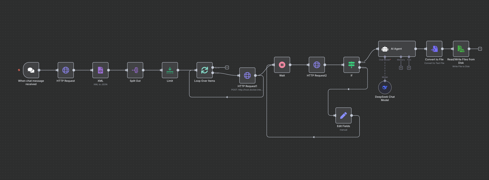

## 备注

- 因为对应的任务 id，不能直接写出来，所以使用中文替换，不然`vercel`部署不通过
- 因为美元符号和 2 个大括号读取变量的问题，也是`vercel`问题，所以这里使用中文描述，使用的时候进行替换
