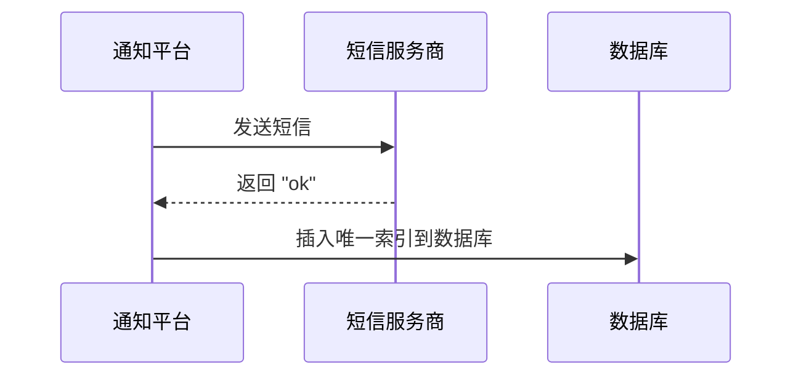
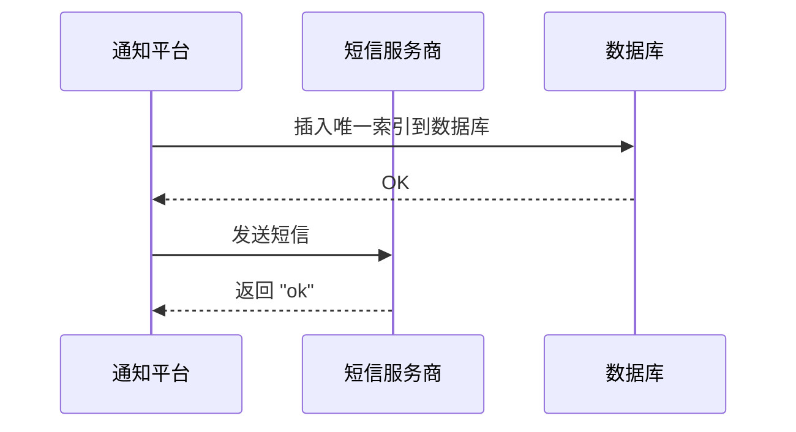
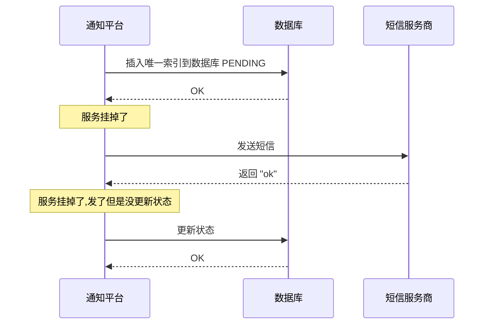
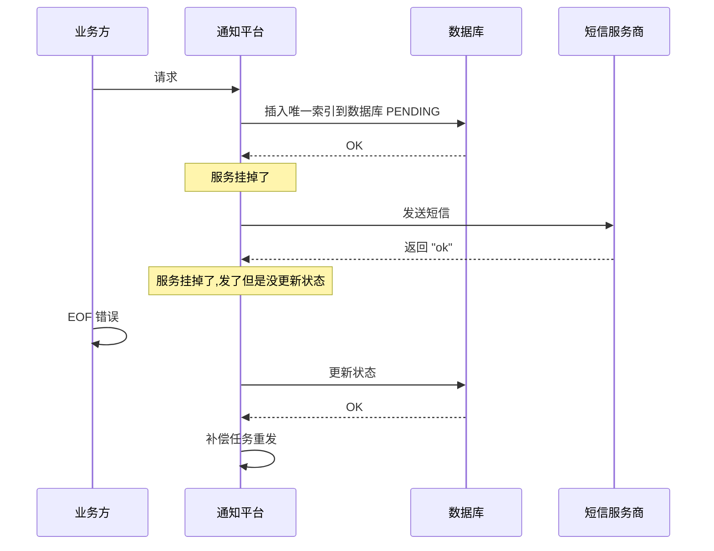

# 通知平台发送幂等问题

## 幂等问题

### 发送语义问题

- 最多一次:也就是通知最多只会被发出去一次,用户可能完全没收到通知
- 恰好一次:也就是通知不多不少,刚好发出去一次
- 最少一次:也就是通知最少发出去一次,问题是用户可能收到多条相同的通知

> 为了达到`恰好一次的`目标,首先要处理幂等问题,通知平台提供的承诺是会根据`key`来保证幂等
>
> 即 **同一个`key`的请求,只会被处理一次**

#### 幂等问题常见方案

- 唯一索引方案: 插入数据库,通过唯一索引冲突来保证幂等
- `Redis`存储 key 方案, Redis 存储已经处理过的`key`,业务方只会在一段时间内使用的`key`,如果崩了就没了
- 布隆过滤器 + 唯一索引方案
- 布隆过滤器 + `Redis` 存储 `key` + 唯一索引方案, `炫技大于实践`
- `Redis` 存储 `key` + 唯一索引方案

> 唯一索引是一切的基础,必须先理解这个方案的处理方式

### 基于唯一索引的幂等方案 - 以短信为例

假设整个业务逻辑是 2 个步骤: 发送短信 + 插入数据库(唯一索引),那么先执行哪一步?

> 第一种

- 通知平台先给短信服务商发送短信
- 短信服务商返回`ok`
- 通知平台在插入唯一索引到数据库

> 重复发送的场景

第一个`goroutine`刚发完短信,还没开始处理插入数据库,第二个`goroutine`就来发送短信了,就会出现重复发送的情况

---

所以一定是先插入数据库,能有效防止并发操作问题

#### 部分失败问题

:::danger 部分失败要注意

如果引入了优雅退出的时候,那么只会在服务宕机的时候出现

:::

解决思路

- 什么也不做,等业务方重试
- 平台恢复后尝试重发,当平台恢复之后尝试重发,等价于收到了一个未立刻发送的请求,有点像延迟发送

---

**部分失败对业务方的影响**

> 业务方只能收到网络相关的错误(`EOF`或者`connection reset`),并且后续完全无法预期用户会收到还是不会收到短信. `通知平台可能在插入唯一索引之前就失败了`,那么后续不会补偿.

