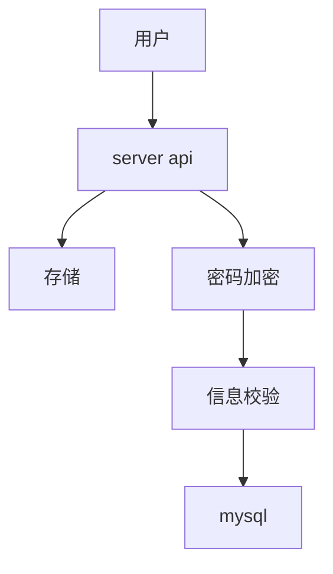

# 工程实践

## 技术选型

基于生产级别的技术选型:

- Gin v1.9.1
- Go v1.20
- go-redis v9
- gorm v1.25.5
- Redis v7.2.0
- MySQL 8.2.0
- Goflow v0.1.4


## 创建工程

1. `mkdir ContentSystem`
2. `cd ContentSystem`
3. `go mod init ContentSystem`


## 创建需要的目录

```bash
├──  cmd
│   └──  main.go
├──  go.mod
├──  internal
│   ├── 󰃨 cache
│   ├──  config
│   ├──  dao
│   ├──  model
│   ├──  services
│   └──  utils
└──  pkg
```


## gin快速入门

安装

```bash
go get -u github.com/gin-gonic/gin
```

> 简单代码

```go
package cmd

import (
	"fmt"

	"github.com/gin-gonic/gin"
)

func main() {
	r := gin.Default()
	r.GET("/ping", func(c *gin.Context) {
		c.JSON(200, gin.H{
			"message": "pong",
		})
	})

	err := r.Run()
	if err != nil {
		fmt.Printf("r run error = %v\n", err)
		return
	}
}

```

### 路由模块

原先我们是直接卸载了`main.go`文件中,现在我们需要将路由进行剥离出去,在`internal`目录下新建`api/routers.go`

```go
package api

import (
	"content-system/internal/services"

	"github.com/gin-gonic/gin"
)

// 路由都会有分组的概念，分组可以让我们更好的管理路由

const (
	rootPath = "/api/" // 根路径
)

func CmsRouters(r *gin.Engine) {
	root := r.Group(rootPath)
	{
		// /api/ping
    root.GET("/ping", func (ctx *gin.Context) {
        ctx.JSON(200, gin.H{
          "message": "pong",
        })
      })
	}
}

```

我们这样处理之后,还有点问题,函数的具体实现也在里面,到时候路由文件就会变得非常的大,所以也需要将对应的处理逻辑方法进行抽离

```go
package api

import (
	"content-system/internal/services"

	"github.com/gin-gonic/gin"
)

// 路由都会有分组的概念，分组可以让我们更好的管理路由

const (
	rootPath = "/api/" // 根路径
)

func CmsRouters(r *gin.Engine) {
	cmsApp := services.NewCmsApp()
	root := r.Group(rootPath)
	{
		// /api/ping
		root.GET("/ping", cmsApp.Ping)
	}
}

```

新建`internal/services/cms.go`

```go
package services

import "github.com/gin-gonic/gin"

type CmsApp struct{}

func NewCmsApp() *CmsApp {
	return &CmsApp{}
}

func (c *CmsApp) Ping(ctx *gin.Context) {
	ctx.JSON(200, gin.H{
		"message": "pong",
	})
}

```

通过这样的方式进行将对应的逻辑进行抽离,可以更好的在各自的方法里去实现对应的功能,而不会显得臃肿.


### 中间件

`Gin`框架中,中间件是用于处理`HTTP`请求和响应的功能模块.中间件函数位于请求处理程序和路由之间,可以在请求被处理之前或之后执行一些额外的操作.

新建`internal/api/middleware.go`

```go
package api

import (
	"fmt"
	"net/http"

	"github.com/gin-gonic/gin"
)

const SessionKey = "session_id"

type SessionAuth struct{}

func (s *SessionAuth) Auth(ctx *gin.Context) {
	sessionId := ctx.GetHeader(SessionKey)
	if sessionId == "" {
		ctx.AbortWithStatusJSON(http.StatusForbidden, gin.H{
			"message": "session is null",
		})
	}
	fmt.Println("session id:", sessionId)
	ctx.Next()
}

```

在路由里进行注册

```go
package api

import (
	"content-system/internal/services"

	"github.com/gin-gonic/gin"
)

// 路由都会有分组的概念，分组可以让我们更好的管理路由

const (
	rootPath = "/api/" // 根路径
)

func CmsRouters(r *gin.Engine) {
	cmsApp := services.NewCmsApp()

	// 注册中间件
	session := &SessionAuth{}
	root := r.Group(rootPath).Use(session.Auth)
	{
		// /api/ping
		root.GET("/ping", cmsApp.Ping)
	}
}

```


### 模型的绑定与验证

在`gin`中,模型绑定和验证是一种方便 HTTP 请求数据的处理和验证的功能

模型绑定指的是将请求中的数据自动绑定到`Go`的结构体,当收到一个包含表单数据,`JSON`数据或者查询字符串的`http`请求时,`gin`可以自动将这些数据解析并绑定到目标结构体中的字段.


```go
package services

import (
	"fmt"
	"github.com/gin-gonic/gin"
)

type HelloReq struct {
	Name string `json:"name" binding:"required"`
}

type HelloResp struct {
	Message string `json:"message" binding:"required"`
}

func (c *CmsApp) Hello(ctx *gin.Context) {
	var req HelloReq
	if err := ctx.ShouldBindJSON(&req); err != nil {
		ctx.JSON(400, gin.H{"error": err.Error()})
		return
	}
	ctx.JSON(200, gin.H{
		"code": 0,
		"msg":  "ok",
		"data": &HelloResp{
			Message: fmt.Sprintf("hello %s", req.Name),
		},
	})
}

```

```go
package api

import (
	"content-system/internal/services"

	"github.com/gin-gonic/gin"
)

// 路由都会有分组的概念，分组可以让我们更好的管理路由

const (
	rootPath = "/api/" // 根路径
)

func CmsRouters(r *gin.Engine) {
	cmsApp := services.NewCmsApp()

	// 注册中间件
	session := &SessionAuth{}
	root := r.Group(rootPath).Use(session.Auth)
	{
		// /api/ping
		root.GET("/ping", cmsApp.Ping)
		root.GET("/hello", cmsApp.Hello)
	}
}

```


## 注册流程



### database tool 的工程实践

新建`script/user.sql`

> 第一版本

```sql
create database `cms_account`;

use `cms_account`;

create table `account`
(
    `id`         bigint(20)   NOT NULL AUTO_INCREMENT COMMENT '主键 id',
    `user_id`    varchar(64)           DEFAULT '' COMMENT '用户 id',
    `nickname`   varchar(64)           DEFAULT '' COMMENT '昵称',
    `password`   varchar(100) NOT NULL,
    `created_at` timestamp    NOT NULL DEFAULT CURRENT_TIMESTAMP COMMENT '创建时间',
    `updated_at` timestamp    NOT NULL DEFAULT CURRENT_TIMESTAMP ON UPDATE CURRENT_TIMESTAMP,
    PRIMARY KEY (`id`)
) ENGINE = InnoDB
  DEFAULT CHARSET = utf8mb4
  COLLATE = utf8mb4_unicode_ci;
```

到你的数据库里进行执行即可.

