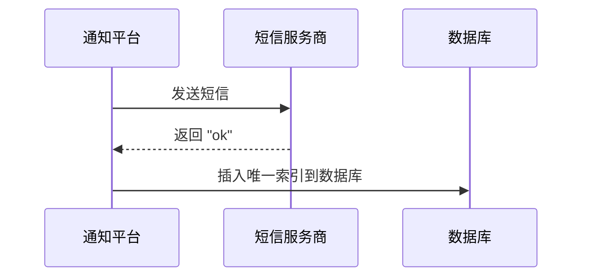
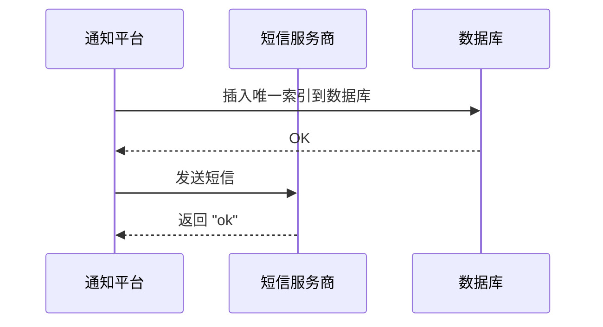
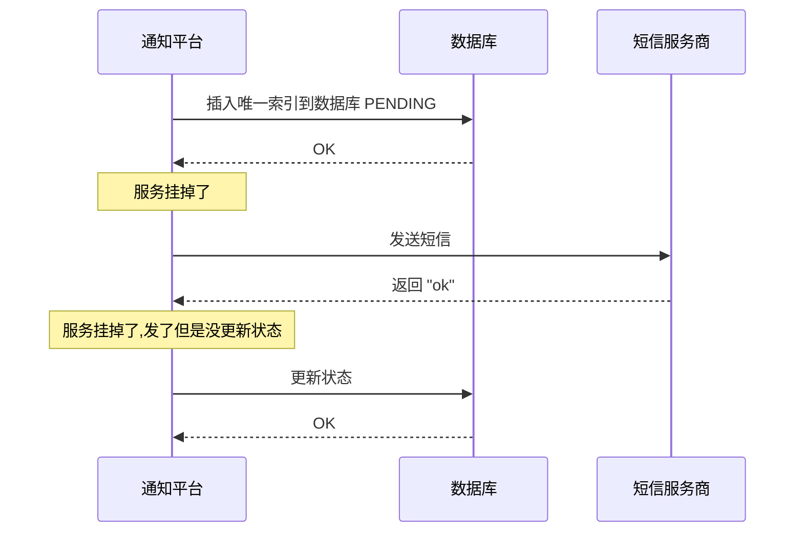
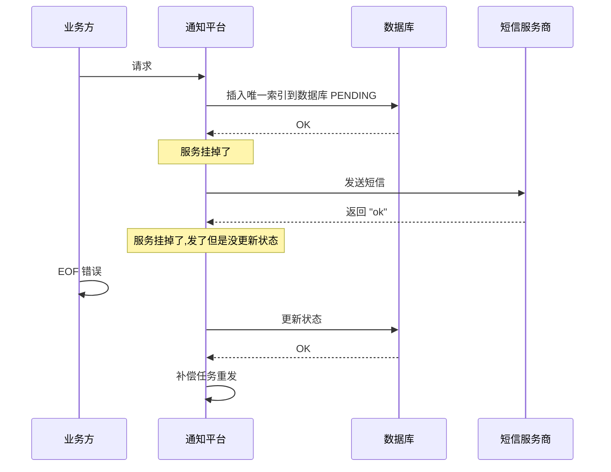

# 项目结构设计

## 项目结构设计

> 建议：你公司用什么项目结构，你就用什么项目结构

- GO 标准优先：遵循 `cmd、internal、pkg`等官方推荐目录结构
- 高内聚低耦合：将功能相似的代码聚合在同一个模块中，避免模块间过度依赖
- 单一职责：每个包职责单一，避免代码膨胀
- 可维护性：使用统一的命名规范，尽量避免深层嵌套
- 避免循环依赖：GO 循环依赖的时候无法通过编译，反而不会有问题

## 常用的目录结构

- my_app
  - api
  - cmd
  - config
  - internal
    - domain
    - service
      - Module1
      - module2
    - repository
      - dao
      - cache
    - pkg
    - api
      - consumer
      - web
      - grpc
    - job

---

- `service`一方面是领域服务，另外一方面也包含了适配层
- `repository`承担缓存和数据存储两方面的职责
- `pkg`在`internal`里面，因为我不想被别人使用

## gRPC API 管理

集中式管理

- 版本管理不方便
- 变更频繁，互相影响

伴随主项目

- 业务方引入不方便
- 如果 my_app 下还有别的公开类型、字段，会被误用

独立 API 项目

- 研发使用麻烦

## 其余项目结构

- kratos：https://go-kratos.dev/docs/intro/layout
- Go-zero：https://go-zero.dev/docs/concepts/layout

> 项目结构不是一个技术话题，是一个权力话题，你到了 CTO 层面，你说啥结构就是啥结构。

## 原则

### 面向接口编程

- 解耦：调用方只需依赖接口，无需关心具体实现类
- 高可扩展：系统功能扩展时，无需修改现有代码，只需新增实现类
- 高可测试性：通过接口模拟 Mock，外部依赖，便于单元测试
- 灵活实现：灵活切换不同实现
- 利于团队合作：接口作为契约，不同团队可独立开发实现模块

### 使用依赖注入

在实现的时候，坚持依赖注入。

依赖注入：通过外部传递依赖对象，实现对象间的解耦。即：我的字段的值都是别人给我的值

```go
type B structure {
  c C
}

func NewB(c C) B {
  return B{c: c}
}

type C struct {}
```

#### 依赖注入的的传导性

前面 B 依赖 C，后面还会有 A 依赖 B，那么写法也是类似的，那么谁来创建 B？创建 B 说需要的 C 又由谁来创建？

> 答案就是在`main`函数中，或者说初始化的过程中，完成这种依赖链条的创建。

```go
type A struct {
  B B
}

func NewA(b B) A {
  return A{B: b}
}

type B struct {
  c C
}

func NewB(c C) B {
  return B{c: c}
}

type C struct {}
```

```go
func main() {
  // 从最底层的依赖开始建立起来
  c := C{}
  b := NewB(c)
  a := NewA(b)

  println(a)
}
```

## 违反依赖注入的几种范式-自己读取配置文件

一种典型的错误就是在创建对象的方法里面自己读取配置文件，而后自己创建以来么，完成整个初始化。

```go
func NewB1() B {
  name := conf.GetString("name")
  return B{
    c: C {
      name: name,
    },
  }
}

func main () {
  a := A{B: NewB1()}
  println(a)
}
```

缺陷：

- 如果 C 是一个接口，那么 A 就没有办法指定实现使用哪一种 C 的实现
- 难测试，也就是 A 没有办法通过注入一个 mock 的 C 的实现，来提高可测试性

## 违反依赖注入的第二种范式-包变量

> 包变量是万恶之源

```go
func DoSomething() {
  dao.Dao.Get(context.Background(), 123)
}

func DoAnysomething() {
  dao.Dao.Get(context.Background(), 123)
}
```

缺陷：

- 无法灵活替代实现
- 包变量将不同的模块、类型、方法耦合在一起
- 可测试性奇差无比

## 面向接口编程和依赖注入

如果 A 依赖于 B，那么

- B 必然是一个接口
- A 依赖的 B 会在初始化 A 的时候从外部传入进来
- 在初始化过程中，组装 A 的时候会指定 B 的具体实现

简单来说，就是 `a := NewA(&B1)`其中的`B1`是`B`的一个实现


## 幂等问题

### 发送语义问题

- 最多一次:也就是通知最多只会被发出去一次,用户可能完全没收到通知
- 恰好一次:也就是通知不多不少,刚好发出去一次
- 最少一次:也就是通知最少发出去一次,问题是用户可能收到多条相同的通知


> 为了达到`恰好一次的`目标,首先要处理幂等问题,通知平台提供的承诺是会根据`key`来保证幂等
>
> 即 **同一个`key`的请求,只会被处理一次**

#### 幂等问题常见方案

- 唯一索引方案: 插入数据库,通过唯一索引冲突来保证幂等
- `Redis`存储 key 方案, Redis 存储已经处理过的`key`,业务方只会在一段时间内使用的`key`,如果崩了就没了
- 布隆过滤器 + 唯一索引方案
- 布隆过滤器 + `Redis` 存储 `key` + 唯一索引方案, `炫技大于实践`
- `Redis` 存储 `key` + 唯一索引方案

> 唯一索引是一切的基础,必须先理解这个方案的处理方式


### 基于唯一索引的幂等方案 - 以短信为例

假设整个业务逻辑是 2 个步骤: 发送短信 + 插入数据库(唯一索引),那么先执行哪一步?


> 第一种

- 通知平台先给短信服务商发送短信
- 短信服务商返回`ok`
- 通知平台在插入唯一索引到数据库



> 重复发送的场景

第一个`goroutine`刚发完短信,还没开始处理插入数据库,第二个`goroutine`就来发送短信了,就会出现重复发送的情况

---

所以一定是先插入数据库,能有效防止并发操作问题



#### 部分失败问题




:::danger 部分失败要注意

如果引入了优雅退出的时候,那么只会在服务宕机的时候出现

:::


解决思路

- 什么也不做,等业务方重试
- 平台恢复后尝试重发,当平台恢复之后尝试重发,等价于收到了一个未立刻发送的请求,有点像延迟发送

---

**部分失败对业务方的影响**

> 业务方只能收到网络相关的错误(`EOF`或者`connection reset`),并且后续完全无法预期用户会收到还是不会收到短信. `通知平台可能在插入唯一索引之前就失败了`,那么后续不会补偿.



