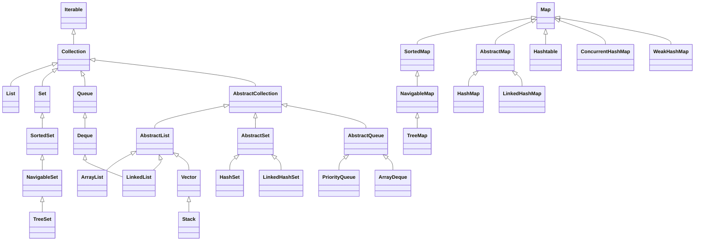
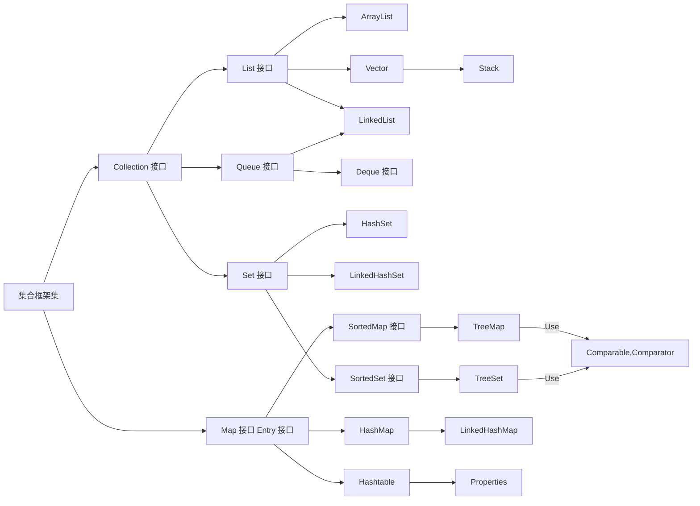

# Java 基础面试题

## JDK 和 JRE 有什么区别?

- JRE 是运行环境(Java Runtime Environment),包含了 JVM 和 Java 核心类库
- JDK 是 Java 开发工具包(Java Developer's Kit),包含了 JRE 和 Java 常见的开发工具(javac, java, jconsole,jvisualvm...)

## 说一下你对==和 equals 的认识,它们有什么差别?[高频]

1. `==`可以比较引用数据类型也可以比较基本数据类型

   - 比较基本数据类型,比较的是数值
   - 比较引用数据类型,比较的是地址值

2. `equals`只能比较引用数据类型,是因为`equals`是`Object`类中的一个方法,要使用方法只能通过对象进行使用,而对象就是引用数据类型
   - 默认情况下比较的也是对象的地址值
   ```java
    public boolean equals(Object obj) {
        return this == obj;
    }
   ```
   - 可以通过重写`Object`类中的`equals`方法实现比较 2 个对象的属性

## 如果 2 个对象的 hashCode 值一样,则它们用 equals 比较也是为 true,是不是?[高频]

> 不是

`hashCode`方法和`equals`方法是 2 个独立的方法,本质上没有任何的关系.它们都是`Object`类中的方法,这两个方法可以被子类进行重写,子类重写可以自定义具体的逻辑

```java
public class Demo {

    public static void main(String[] args) {
        String s1 = "重地";
        String s2 = "通话";

        System.out.println(s1.hashCode() == s2.hashCode()); // true
        System.out.println(s1.equals(s2)); // false
    }
}

```

## 综合说下 final 的作用?

- 修饰在变量上,叫常量,该常量必须初始化,初始化之后的值就不能修改,而常量一般全部都是用大写来命名
- 修饰在类上,该类不能被继承
- 修饰在方法上,该方法不能被重写

## String 是基本数据类型吗?

`String`不是基本数据类型,基础类型有 8 种: `byte, boolean, char, short, int, float, long, double`.
`String`属于引用数据类型

## 对字符串操作都有哪些类并详细的介绍它们之间的区别?[高频]

对字符串操作的类有: `String, StringBuffer, StringBuilder`

1. `String`是不可变的字符串

```java
String a = "abc";
a = "bcd";
```

:::danger 注意
不可变指的是字符串常量`"abc"`不可变,作为字符串的变量`a`是可变的
:::

2. `StringBuilder, StringBuffer`是可变的字符串
3. `StringBuffer`是线程安全的,`StringBuilder`是线程不安全的
4. `StringBuffer`保证线程安全的原理: 就是针对每一个方法都添加了一个`synchronized`关键字,将其声明为了同步方法.

## String str = "abc"和 String str = new String("abc")的定义方法一样吗?

> 不一样

`String str = "abc`": 是创建一个字符串对象`abc`放入常量池中

`String str = new String("abc")`: 创建了 2 个对象,`abc`字符串对象在常量池中, `new String("")`在堆内存中又创建了一个新的对象

## 普通 for 和增强 for 的区别

作用与应用场景:

- 普通 for 循环: 可以用于所有需要重复执行的某些语句的场景
- 增强 for 循环: 只能有公寓遍历数组和`Collection`集合

使用区别:

- 如果使用普通 for 遍历数组,需要指定下标值,可以修改数组的元素
- 如果使用增强 for 遍历数组,不需要指定下标,但无法修改数组的元素
- 另外,增强 for 循环只是一种语法糖,增强 for 循环遍历数组时编译器仍然会将对应代码转换为普通 for 循环;增强 for 循环遍历`Collection`集合时编译器会将对应代码转换为`Iterator`迭代器遍历集合的代码

## 方法重载与重写的区别

|           区别           |                       方法重载 Overload                       |                                                                                                   方法重写 Override                                                                                                    |
| :----------------------: | :-----------------------------------------------------------: | :--------------------------------------------------------------------------------------------------------------------------------------------------------------------------------------------------------------------: |
|       两个方法位置       |                      同一个类中或父子类                       |                                                                                                         子类中                                                                                                         |
|        权限修饰符        |                              无                               |                                                                     `private`方发不能被重写;重写方法的权限修饰符需要满足`>=`被重写方法的权限修饰符                                                                     |
|        其他修饰符        |                              无                               |                                                                                          `final`,`static`修饰的方法不能被修改                                                                                          |
|        返回值类型        |                              无                               |                                                             基本数据类型和`void`必须相同; 引用数据类型: 重写方法的返回值类型要满足`<=`重写方法的返回值类型                                                             |
|          方法名          |                           必须相同                            |                                                                                                        必须相同                                                                                                        |
|         形参列表         |                           必须不同                            |                                                                                                        必须相同                                                                                                        |
|     throws 异常列表      |                              无                               | 被重写的方法没有`throws`编译时异常类型,重写方法就不能`throws`编译时异常类型;被重写方法`throws`编译时异常类型,重写方法`throws`编译时异常类型必须`<=`被重写方法`throws`编译时异常类型;`throws`运行时异常类型不做任何检查 |
| 什么时候确定调用哪个方法 | 在编译时期确定调用哪个方法,由传递给方法实际参数类型和数量决定 |                                                                                   在运行时确定调用哪一个方法,这依赖于对象的实际类型                                                                                    |

## 抽象类与接口的区别

都是用来提供一种形式的抽象和代码复用的方式.

> 抽象类:

1. 继承限制: 有单继承限制
2. 成员:
   1. 抽象类可以有多种类型的成员变量,包括实例变量和静态变量
   2. 抽象类可以有构造方法,这有助于子类的初始化
   3. 抽象类可以包含初始化块(静态代码和非静态代码块)
   4. 抽象类可以包含抽象方法和普通方法

> 接口

1. 多实现: 一个类可以实现多个接口
2. 成员:
   1. 接口中不允许有构造方法和初始化块
   2. 接口成员变量默认是`public, static和final`的,即常量
   3. 接口的方法默认是`public`的,`JDK9`之后允许有`private`方法
   4. `java8`之前接口中的所有方法默认是抽象的,在`java8`之后可以包含默认方法和静态方法

> 设计意图

- **抽象类**通常用来定义一组相关类的公共行为和状态,以及一些通用的功能实现
- **接口**则更多的用来定义类的行为规范,而不关心具体的实现细节.它通常用来表达"这个类能做什么"

## 谈谈你对面向对象的三大特性的理解

封装,继承,多态,使代码更具模块性,可重用性和可维护性

1. 封装: 将数据(属性)和操作这些数据的方法捆绑在一起,形成一个整体,也就是"对象".同时,封装还意味着隐藏对象的内部状态和实现细节,只暴露必要的公共接口供外部访问.这样做的好处是可以保护对象的状态不被外部代码随意更改,从而增加代码的安全性和稳定性.封装还使得对象的实现可以独立于使用对象的代码,提高了代码的可维护性.封装主要通过访问控制符`private,protected,public`来实现,`private`关键字可以限制只有类内部的代码可以访问某些属性和方法,而`public`则可以让外部代码访问.此外,还可以通过提供`getter`和`setter`方法来间接访问和修改属性,以增强对属性的控制
2. 继承: 继承允许创建一个新类(子类),该类继承了现有类(父类)的属性和方法.子类可以调用父类的代码.同时也可以覆盖父类或扩展父类的行为.继承支持代码的重用,减少了代码重复,使得程序结构更加清晰和模块化
3. 多态: 是指同一种事物在不同状况小爱有不同的表现形式.多态有两种形式: 静态多态(也称编译时多态,如方法重载)和动态多态(也称运行时多态,如方法重写).动态多态是通过继承和接口实现的,允许我们使用父类或接口类型的引用指向子类对象,然后调用方法时,会根据对象的实际类型来决定调用哪个方法的实现.这样可以编写出更加灵活和可扩展的代码

## 访问修饰符的作用范围由大到小,以及各自的范围是什么?可以修饰什么?

修饰符的作用范围由大到小: `public,protected,缺省,private`

|                  | 本类 | 本包的所有类 | 其他包的子类 | 其他包的非子类 |
| ---------------- | ---- | ------------ | ------------ | -------------- |
| private          | √    | ×            | ×            | ×              |
| 缺省(不写修饰符) | √    | √            | ×            | ×              |
| protected        | √    | √            | √            | ×              |
| public           | √    | √            | √            | √              |

| 修饰的角色 | class(外部类) | 成员变量 | 成员方法 | 成员的内部类 |
| ---------- | ------------- | -------- | -------- | ------------ |
| private    | ×             | √        | √        | √            |
| 缺省(不写) | √             | √        | √        | √            |
| protected  | ×             | √        | √        | √            |
| public     | √             | √        | √        | √            |

## throw 和 throws 的区别

1. `throw`
   1. 是一个关键字,用于在代码里显式的抛出一个异常
   2. 它后面跟着一个异常对象,这个对象通常是某个异常类的实例
   3. `throw`通常出现在方法体内部,当特定条件满足时执行
   4. 使用`throw`抛出异常会立即终止当前方法的执行,并将控制权移到调用栈的上一层,寻找适当的异常处理器(如`catch`块)
2. `throws`
   1. 也是一个关键字,但它用于方法的声明部分,而不是方法体内部
   2. 它后面可以跟着一个活多个异常类的名称,这些异常是方法可能抛出的,用逗号隔开
   3. 当一个方法不能活不应该处理它内部发生的某些异常时,可以使用`throws`来声明这些异常,这样调用者必须处理这些异常,要么捕获处理,要么继续声明抛出.
   4. `throws`提供了对调用者的一种合同,表名方法可能抛出哪些类型的异常,使用者能够做出相应的准备

> 总结

- `throw`用于抛出具体的异常对象,它意味着一个异常正在发生
- `throws`用于声明方法可能抛出的异常类型,它意味着如果在方法内部发生这些异常,方法本身不会处理他们,而是将他们抛给调用者.

## Java 的集合容器都有哪些?[高频]





:::info
画的略有瑕疵,可能表达不出真正的内容.
:::

## Collection 和 Collections 有什么区别?

`Collection`是一个单列集合的顶层接口

`Collections`是集合类的一个工具类,包含了对集合元素进行排序和线程安全等各种操作方法

## 如何把一个线程不安全的 List 集合转成线程安全的 List 集合

- 直接使用`Collections`集合工具类的`synchronizedList()`方法
- 直接选择`Vector`或`CopyOnWriteArrayList`
- 自定义一个类,让其去实现`List`接口,重写`List`接口中的方法,然后在该方法加同步保证线程安全性

## List,Set,Map 之间的区别是什么?[高频]

`List`集合

1. 属于单列集合,存储的都是一个一个元素
2. List 集合存在重复元素
3. 每一个元素都有对应的索引,可以通过索引获取元素
4. 元素的存取顺序一致

`Set`集合

1. 属于单列集合,存储的都是一个一个元素
2. 元素唯一,不可重复
3. 元素没有索引,不能通过索引获取元素
4. 除了`LinkedHashSet`之外不能保证元素的存取顺序一致

`Map`集合

1. 属于双列集合,存储的是一对一的元素,即`(key, value)`键值对
2. `key`不可重复和修改 ,`value`可以重复和修改

## HashMap 和 Hashtable 有什么区别?[高频]

不同点

1. `HashMap`可以把`null`作为`key`或`value`,`Hashtable`不可以
2. `HashMap`线程不安全,效率高.`Hashtable`线程安全,效率低

## 如何决定使用 HashMap 还是 TreeMap?

`TreeMap`可以对元素进行排序,因此如果需要对元素按照某一种规则进行排序,此时可以选择`TreeMap`.没有特殊要求一般选择`HashMap`

## ArrayList 和 LinkedList 的区别是什么?[高频]

`ArrayList`底层实现的数据结构是数组,根据下标查询效率极高,时间复杂度是`O(1)`,末尾位置增删需要移动元素,添加元素需要扩容

`LinkedList`底层数据结构是双向链表,根据下标查询效率低,时间复杂度是`O(n)`,增删元素时,不需要扩容和移动元素,只需要修改前后节点的引用关系

理论上数组结构的增删慢,链表结构的增删快,但现在内存拷贝技术性能提高之后 ,`ArrayList`的整体性能反而优于`LinkedList`,因为`LinkedList`内部需要创建节点对象,这是一个耗时的过程

## 如何做到数组和 List 之间的转换?

`List`对象转换为数组: 可以调用`List`的`toArray()`方法

数组转换为`List`: 调用`Arrays.asList()`方法,但该方法得到一个不可增删元素的`List`集合


## ArrayList 和 Vector 的区别是什么?

`Vector`是线程安全的,而`ArrayList`不是,所以在单线程情况下,建议使用`ArrayList`

在扩容时,`Vector`是扩容100%,即 2 倍,但`ArrayList`是扩容`50%`,即 1.5 倍,后者更节省内存

`ArrayList`默认的容量是 10(在首次添加元素时才创建数组),`Vector`默认的容量是 10 (在创建集合对象时就直接创建数组)


## 哪些集合类是线程安全的?

`Vector`: 比`ArrayList`多了一个同步化机制

`Stack`: 堆栈类,是`Vector`的子类,先进后出,项目中使用的不多

`Hashtable`: 比`HashMap`多了一个线程安全,项目中一般使用`HashMap`
