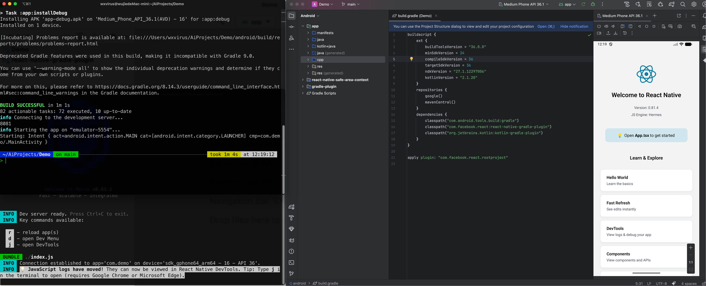

# React Native

## 创建新项目

- 初始化项目（最新RN版本）

  ```bash
  npx @react-native-community/cli init AwesomeProject
  ```

- 初始化项目（指定RN版本）

  ```bash
  npx @react-native-community/cli init AwesomeProject --version x.xx.x
  ```


```bash
npx @react-native-community/cli init Demo
```

如果出现`Do you want to install CocoaPods now`

这个是用于`IOS`运行的，可以暂时先不安装。如果是你准备做`Android`，那么这些关于`IOS`的有关的都可以不用管。


## 安装项目依赖

```bash
npm install
```

现在初始化完项目应该都是安装完了的，下面开始安装原生依赖。

可以使用`Android Studio`打开新建的项目的里面的`android`目录，进行安装一些依赖。

然后使用`npm run android`启动



